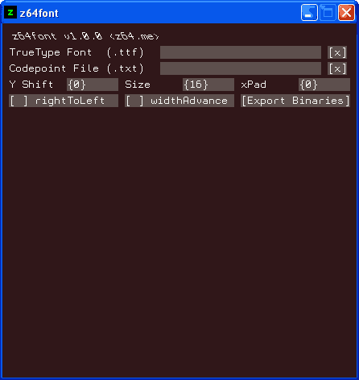

# z64font

`z64font` is a font tool that rasterizes TrueType font (`.ttf`) files
into a format compatible with Ocarina of Time and Majora's Mask.
Whether you're looking to localize these games into new languages that
rely on brand new character sets, or you're just adding a fresh coat of
paint to your romhack, this program makes your job a whole lot easier.



## How to use

`z64font` requires you to provide only two files:
 - A UTF8-encoded text document containing a sample string and
   a list of codepoints.
 - The TrueType font (`.ttf`) file you wish to convert.

Here are the latest codepoint files (simply `Ctrl + S` in your browser):
 - [Ocarina of Time codepoints](https://raw.githubusercontent.com/z64me/z64font/main/codepoints/oot.txt)
 - [Majora's Mask codepoints](https://raw.githubusercontent.com/z64me/z64font/main/codepoints/mm.txt)

You can use your scroll wheel to effortlessly tweak each control.

What you do next depends on your workflow.

<!--### [`zzrtl`](https://github.com/z64me/zzrtl) users

Overwrite the `font_static` and `font_width` files in your project's
root directory with these new files.
TODO implement external font file support in zzrtl
-->

### Traditional hackers

Once you are happy with how your font is displaying in the preview window,
click the `Export Binaries` button. You will be prompted to select a
location and filename for them. Let's assume you chose the name `wow`.

Once you have done that, two files will be generated: `wow.font_static`
and `wow.font_width`.

Inject the files into your decompressed game using a hex editor.
For Windows users, I recommend [HxD](https://mh-nexus.de/en/hxd/).

| Game          | .font_static    | .font_width                   |
| ------------- | --------------- | ----------------------------- |
| OoT debug     | `0x008C1000`    | `0x00BCABA0`                  |
| OoT NTSC 1.0  | `0x00928000`    | `0x00B88EA0`                  |
| MM USA        | `0x00ACC000`    | `0x00C669B0` and `0x00C66E50` |

If you don't know how to decompress your copy of the game, look no
further than [`z64decompress`](https://github.com/z64me/z64decompress).

### [OoT decomp](https://github.com/zeldaret/oot)
To export for OoT decomp first make sure `decompMode` is checked.
You must provide a text file with the names of the png files to export. An [`oot_decomp_fn.txt`](https://raw.githubusercontent.com/z64me/z64font/main/codepoints/oot_decomp_fn.txt) is included already.

Once you are happy with how your font is displaying in the preview window,
click the `Export Decomp` button. You will be prompted to select a
location and filename for the export. Let's assume you chose the name `wow`.

Once you have done that, a `.png` will be generated for every character, as well as a `wow.font_width.h`.

To add all the textures to your decomp repository, navigate to `oot/assets/textures/nes_font_static`, and place all of the generated files in this folder, overwriting as necessary.

Next, we need to update the spacing between each character. To do so, open `oot/src/code/z_message_PAL.c`, and find the [`sFontWidths`](https://github.com/zeldaret/oot/blob/master/src/code/z_message_PAL.c#L589) array. Next, replace the entire array with this:
```c
f32 sFontWidths[] = {
#include "textures/nes_font_static/wow.font_width.h"
};
```

Now `make clean && make` to compile the new font.

### [MM decomp](https://github.com/zeldaret/mm) users
The MM decomp will be made targetable once it finalizes its font handling.
